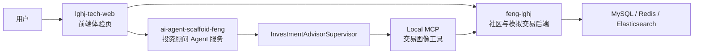

# 量股化金 AI 智能投资顾问系统

量股化金是一套面向股票社区与模拟交易场景的 AI 投资顾问系统，目标是解决交易数据孤立、风控反馈滞后和投资建议缺乏个性化的问题。系统以 Spring Boot 交易后端为基础，结合标准化 Agent 脚手架，构建从模拟交易、订单撮合、交易画像到多智能体投资顾问的完整闭环。

项目采用前后端分离与 Agent 服务解耦架构，后端负责社区、行情检索、模拟交易、持仓管理、订单撮合与交易画像沉淀；Agent 服务基于 Supervisor / Hierarchical 编排模式，将投资咨询拆分为市场分析、技术分析、个人交易画像、风险评估、组合建议与合规提示等子任务，并通过本地 MCP 工具读取用户模拟交易画像，为用户生成更贴近自身交易行为的投资观察建议。

> 本项目仅用于技术学习与工程实践展示，不构成证券投资建议或收益承诺。

## 项目结构

```text
.
├── feng-lghj                  # 股票社区与模拟交易后端
├── ai-agent-scaffoid-feng     # AI Agent 脚手架与投资顾问服务
└── lghj-tech-web              # React 科技风前端体验页
```

## 核心能力

- **股票社区与模拟交易后端**：支持用户登录、社区内容、自选股、股票检索、模拟账户、委托下单、撮合成交、撤单、成交记录与持仓管理。
- **交易撮合与一致性保障**：围绕订单校验、资金冻结、持仓变更、成交落库和订单状态流转设计撮合流程，并通过 Redis / Redisson 分布式锁保障并发交易场景下的数据一致性。
- **交易画像分析**：聚合用户模拟账户、持仓、近期委托、近期成交、仓位集中度、买卖偏好和异常委托行为，形成可供 AI 投顾使用的个人交易画像。
- **Supervisor 多智能体投顾**：基于 Google ADK 与脚手架策略链扩展 Supervisor 编排模式，协调市场分析、技术分析、风险评估、组合建议和合规提示等子 Agent。
- **本地 MCP 工具接入**：将交易画像查询能力封装为脚手架 local MCP Server Tool，由 Agent 在需要个性化分析时调用，实现交易系统能力与智能体编排解耦。
- **本地化部署适配**：后端升级到 JDK 17，移除外部预测服务与 Timescale 运行依赖，默认使用 MySQL、Redis、Elasticsearch 与 HTTP 接口完成本地启动。

## 技术栈

| 模块 | 技术 |
| --- | --- |
| 交易后端 | Spring Boot 2.7.12, MyBatis-Plus, MySQL, Redis, Redisson, Elasticsearch |
| Agent 服务 | Spring Boot, Google ADK, Spring AI, MCP, Supervisor / Hierarchical Workflow |
| 前端体验页 | Vite, React, TypeScript, lucide-react |
| 工程环境 | JDK 17, Maven, Node.js |

## 架构概览



## Agent 投资顾问流程

1. 用户通过 Agent 服务发起投资咨询或交易复盘问题。
2. `InvestmentAdvisorSupervisor` 判断问题类型并调度子 Agent。
3. 当问题涉及“我的持仓、模拟交易、交易记录、个性化建议、风险偏好”等内容时，优先调度个人交易画像 Agent。
4. 个人交易画像 Agent 通过 local MCP 工具调用交易系统内部画像接口，获取当前用户的模拟交易上下文。
5. Supervisor 聚合市场分析、技术分析、交易画像、风险评估、组合建议与合规提示，输出结构化中文答复。

## 关键接口

### Agent 服务

```text
GET  /api/v1/query_ai_agent_config_list
GET  /api/v1/create_session
POST /api/v1/chat
POST /api/v1/chat_stream
```

推荐投资顾问 `agentId`：

```text
investment-advisor
```

### 交易画像内部接口

```text
GET /api/internal/sim-trade/profile?userId={userId}
```

该接口由 Agent 的 local MCP 工具间接调用，用于生成个性化投资顾问上下文。

## 本地启动

### 1. 环境准备

- JDK 17
- Maven 3.8+
- MySQL 8.x
- Redis
- Elasticsearch
- Node.js 18+

### 2. 启动交易后端

```bash
cd feng-lghj
mvn -pl lghj-server -am test
```

在 IDE 中启动：

```text
com.lghj.LiangGuHuaJinApplication
```

按本地环境修改：

```text
feng-lghj/lghj-server/src/main/resources/application-dev.yml
```

### 3. 启动 Agent 服务

```bash
cd ai-agent-scaffoid-feng
mvn -pl ai-agent-scaffoid-feng-app -am test
```

在 IDE 中启动：

```text
cn.feng.Application
```

常用环境变量：

```text
AI_AGENT_BASE_URL=https://api.deepseek.com
AI_AGENT_API_KEY=你的模型 API Key
AI_AGENT_MODEL=deepseek-chat
LGHJ_BASE_URL=http://127.0.0.1:8080
```

### 4. 启动前端体验页

```bash
cd lghj-tech-web
npm install
npm run dev -- --host 127.0.0.1
```

默认访问：

```text
http://127.0.0.1:5173/
```

## 验证命令

```bash
# 交易后端
cd feng-lghj
mvn -pl lghj-server -am test

# Agent 服务
cd ai-agent-scaffoid-feng
mvn -pl ai-agent-scaffoid-feng-app -am test

# 前端体验页
cd lghj-tech-web
npm run build
```

## 项目亮点

- 使用 Supervisor 多智能体编排拆分复杂投顾任务，降低单 Agent 提示词膨胀和职责混乱问题。
- 通过 local MCP 将交易画像能力标准化封装，Agent 不直接耦合交易系统实现。
- 基于模拟交易记录生成个人交易画像，使投顾建议从通用问答升级为行为驱动的个性化分析。
- 对交易撮合、订单恢复和并发交易场景引入分布式锁，提升核心交易流程可靠性。
- 将交易系统、Agent 服务和前端体验页拆分为独立模块，便于单独部署、演进与替换。

## 免责声明

本项目中的行情、交易和投资顾问内容仅用于技术演示、学习交流与工程实践，不构成任何证券、基金或其他金融产品的投资建议。AI 输出存在不确定性，实际投资需自行判断并承担风险。
