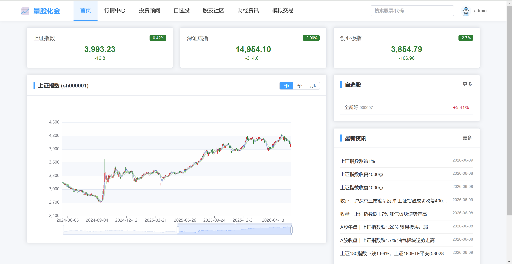
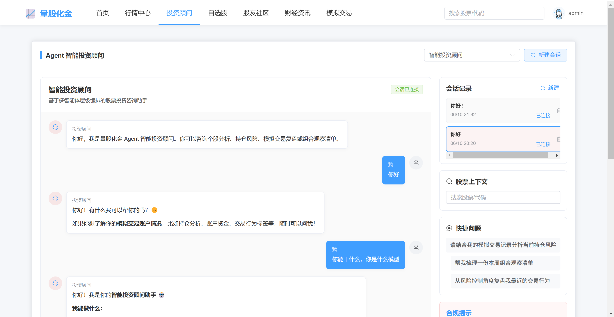
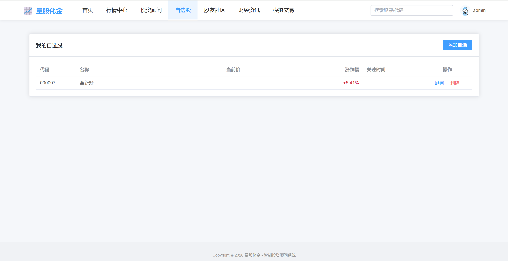
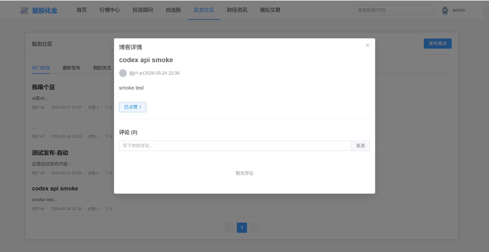
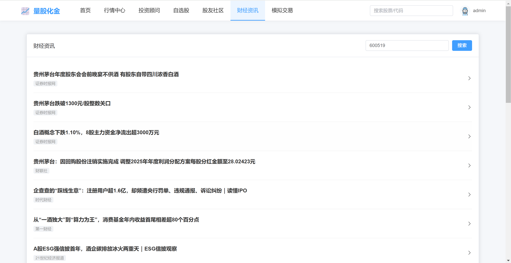
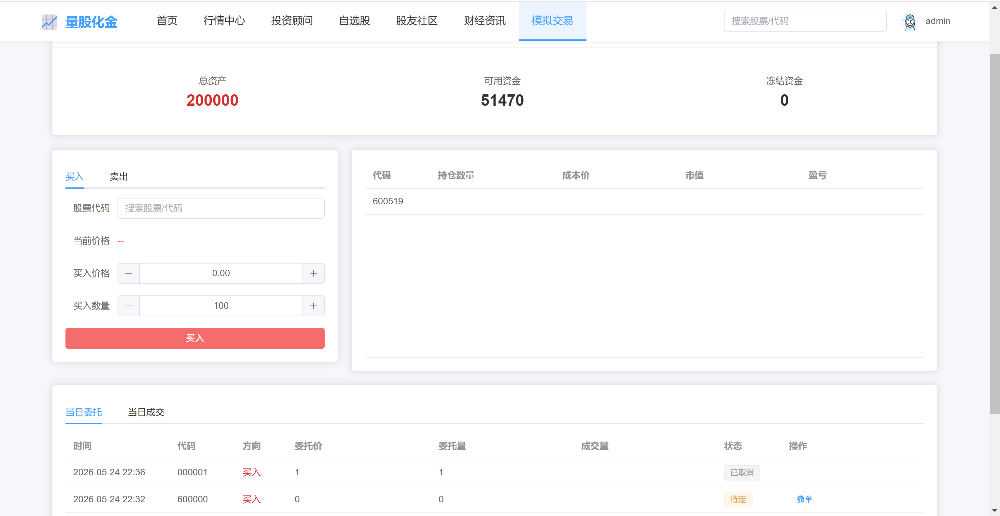
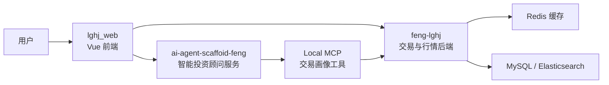

# 量股化金：AI 智能投资顾问系统

量股化金是一套围绕 A 股投资场景设计的全栈系统：它把行情看盘、自选股、财经资讯、股友社区、模拟交易和 AI 投资顾问放在同一个工作台里，让用户从“看到市场变化”到“理解风险与机会”，再到“用模拟交易验证想法”形成一条完整闭环。

系统由 Spring Boot 交易与行情后端、Vue 3 前端、独立 Agent 服务组成。后端负责行情、资讯、自选股、社区、模拟交易、撮合与交易画像沉淀；Agent 服务负责多智能体投资咨询、会话管理和个性化分析；前端则提供面向普通投资者的统一交互入口。

> 本项目仅用于技术学习、课程实践与工程展示，不构成任何证券、基金或其他金融产品的投资建议。

## 为什么值得一看

很多演示项目只停留在“能调用接口”或“能展示图表”。量股化金更关注真实投资产品里的连续体验：用户先在首页观察指数和资讯，再把股票加入自选，进入 Agent 顾问追问风险，必要时到模拟交易里验证操作，最后通过交易记录反哺顾问分析。

### 1. 从市场全景开始，而不是从一张空表开始

首页聚合三大指数、主 K 线、自选股和最新资讯。历史 K 线统一由 8080 后端提供，并接入 Redis 24 小时缓存；资讯接口会把 `sh000001`、`sz399001`、`sz399006` 等指数代码自动映射成更适合检索的中文关键词。



### 2. 投资顾问不是一次性问答，而是可找回的会话

投资顾问模块把原“股票预测”升级为 Agent 智能投资顾问。它支持会话侧边栏、历史会话找回、删除会话和 Markdown 渲染，适合连续追问“我现在的持仓风险是什么”“这周组合应该怎么观察”“最近交易行为有什么问题”等问题。



### 3. 自选股是后续分析的入口

自选股模块用于沉淀用户关注标的，并展示实时价格、涨跌幅等核心信息。首页、行情页、顾问页和自选股页共享同一套股票上下文，避免每个模块都重新输入代码。



### 4. 社区让投资想法有沉淀、有反馈

股友社区支持观点发布、详情查看、点赞和评论。它不是独立的内容孤岛，而是和行情、资讯、模拟交易一起构成投资决策前的信息层。



### 5. 财经资讯补充个股和行业叙事

财经资讯页支持按股票代码检索相关新闻，适合在看盘或交易前快速补充公司、行业、政策和资金面的背景信息。



### 6. 用模拟交易验证判断，再把交易记录交给 Agent 复盘

模拟交易模块支持资金账户、持仓、买卖委托、当日委托和成交记录。订单撮合、撤单、持仓和资金流转由后端负责，交易记录也可以作为 Agent 生成个性化风险提示和复盘建议的上下文。



## 项目结构

```text
.
├── feng-lghj                  # 股票社区、行情、自选股、模拟交易和撮合后端
├── ai-agent-scaffoid-feng     # AI Agent 脚手架与智能投资顾问服务
├── lghj_web                   # Vue 3 + Element Plus 前端应用
└── docs/images                # README 展示截图等文档资源
```

## 核心能力

- 股票行情首页：展示三大指数、K 线图、自选股和最新资讯。
- 历史行情服务：后端统一提供 `/api/user/stock/data`，支持日 K、周 K、月 K，并使用 Redis 缓存 24 小时。
- 自选股管理：支持添加、删除、查看自选股，并展示实时价格、涨跌幅和成交量。
- 最新资讯：按指数或股票代码查询资讯，指数代码会自动映射为资讯关键词。
- 模拟交易：支持开户、委托下单、撤单、成交记录、持仓和资金管理。
- 订单撮合：通过 Redis / Redisson 保障并发交易场景下的数据一致性。
- Agent 智能投资顾问：支持会话侧边栏、历史会话找回、删除会话、Markdown 渲染和后端 Agent 对接。
- 交易画像分析：为 Agent 提供用户模拟交易上下文，用于个性化投资观察和风险提示。

## 技术栈

| 模块 | 技术 |
| --- | --- |
| 后端服务 | Spring Boot 2.7.12, MyBatis-Plus, MySQL, Redis, Redisson, Elasticsearch |
| Agent 服务 | Spring Boot, Google ADK, Spring AI, MCP, Supervisor / Hierarchical Workflow |
| 前端应用 | Vue 3, Vite, Element Plus, Pinia, Axios, ECharts |
| 工程环境 | JDK 17+, Maven 3.8+, Node.js 18+ |

## 架构概览


```mermaid
flowchart LR
    User["用户"]
    Web["lghj_web<br/>Vue 前端"]
    Backend["feng-lghj<br/>交易与行情后端"]
    Agent["ai-agent-scaffoid-feng<br/>智能投资顾问服务"]
    Redis["Redis 缓存"]
    DB["MySQL / Elasticsearch"]
    MCP["Local MCP<br/>交易画像工具"]

    User --> Web
    Web --> Backend
    Web --> Agent
    Backend --> Redis
    Backend --> DB
    Agent --> MCP
    MCP --> Backend
```

## 关键接口

### 行情与资讯

```text
GET /api/user/stock/data?symbol=sh000001&period=D
GET /api/user/realtime/news?symbol=sh000001&recentN=10
GET /api/user/optional/list
POST /api/user/optional/add?symbol=000001
POST /api/user/optional/remove?symbol=000001
```

### Agent 智能投资顾问

```text
GET  /api/v1/query_ai_agent_config_list
GET  /api/v1/create_session
POST /api/v1/chat
POST /api/v1/chat_stream
```

推荐投资顾问 `agentId`：

```text
investment-advisor
```

### 交易画像内部接口

```text
GET /api/internal/sim-trade/profile?userId={userId}
```

该接口由 Agent 的 local MCP 工具间接调用，用于生成个性化投资顾问上下文。

## 本地启动

### 1. 环境准备

- JDK 17+
- Maven 3.8+
- MySQL 8.x
- Redis
- Elasticsearch
- Node.js 18+

### 2. 启动交易后端

```bash
cd feng-lghj
mvn -pl lghj-server spring-boot:run
```

本地配置文件：

```text
feng-lghj/lghj-server/src/main/resources/application-dev.yml
```

### 3. 启动 Agent 服务

```bash
cd ai-agent-scaffoid-feng
mvn -pl ai-agent-scaffoid-feng-app spring-boot:run
```

常用环境变量：

```text
AI_AGENT_BASE_URL=https://api.deepseek.com
AI_AGENT_API_KEY=你的模型 API Key
AI_AGENT_MODEL=deepseek-chat
LGHJ_BASE_URL=http://127.0.0.1:8080
```

### 4. 启动前端应用

```bash
cd lghj_web
npm install
npm run dev -- --host 127.0.0.1
```

默认访问地址：

```text
http://127.0.0.1:5173/
```

## 验证命令

```bash
# 后端编译
cd feng-lghj
mvn -pl lghj-server -am compile

# 前端打包
cd lghj_web
npm run build
```

## 最近更新

- 将股票预测模块升级为 Agent 智能投资顾问，并接入后端 Agent 服务。
- 智能顾问支持 Markdown 渲染、会话历史、本地会话找回和删除会话。
- 首页历史行情统一接入 8080 后端，删除 8002 独立代理依赖。
- 历史行情新增 Redis 24 小时缓存，并切换为可用行情源。
- 修复首页自选股成交量类型转换异常。
- 修复首页最新资讯空白问题，支持指数代码到资讯关键词的自动映射。

## 免责声明

本项目中的行情、交易和 AI 投资顾问内容仅用于技术演示、学习交流与工程实践。AI 输出存在不确定性，不构成任何投资建议或收益承诺，实际投资需自行判断并承担风险。
